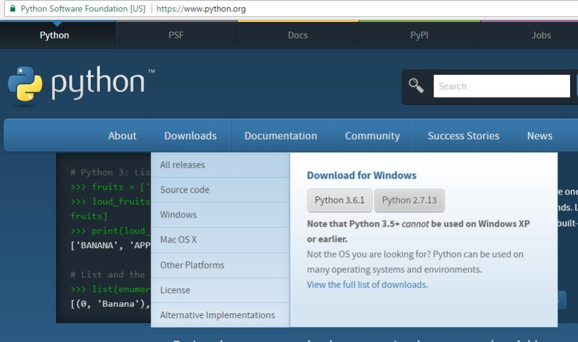
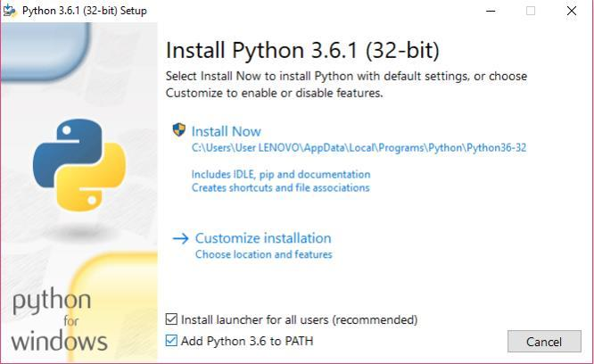
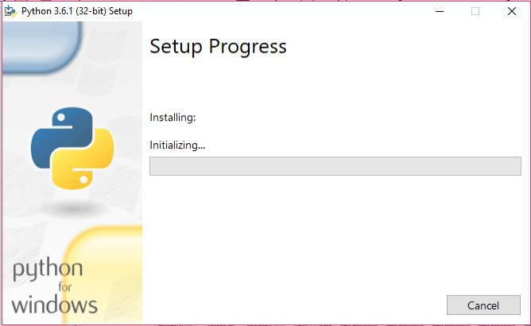
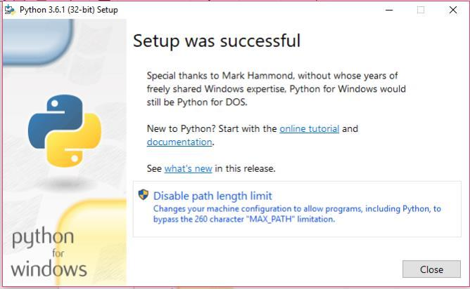
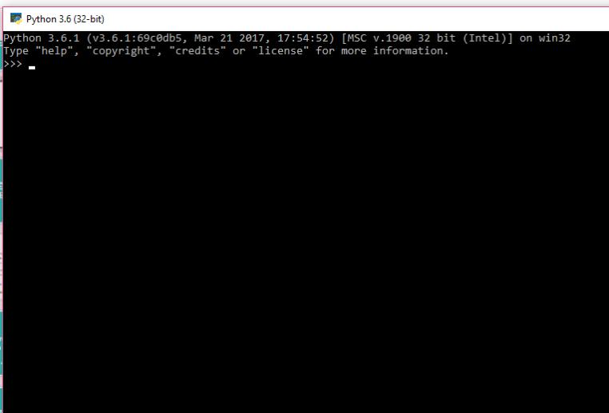
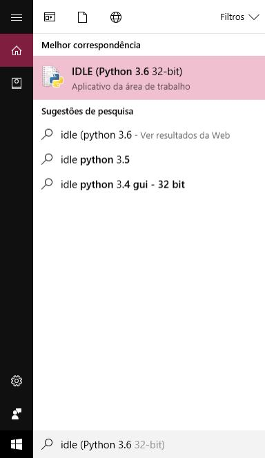
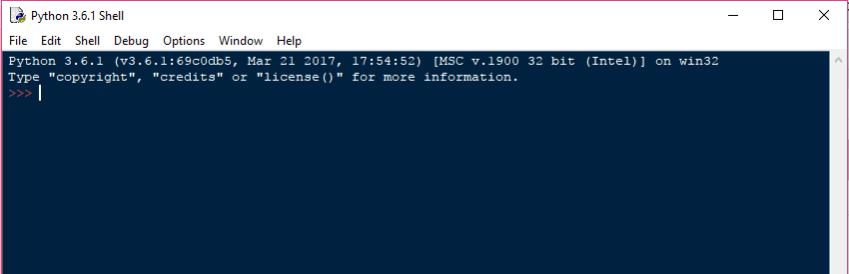
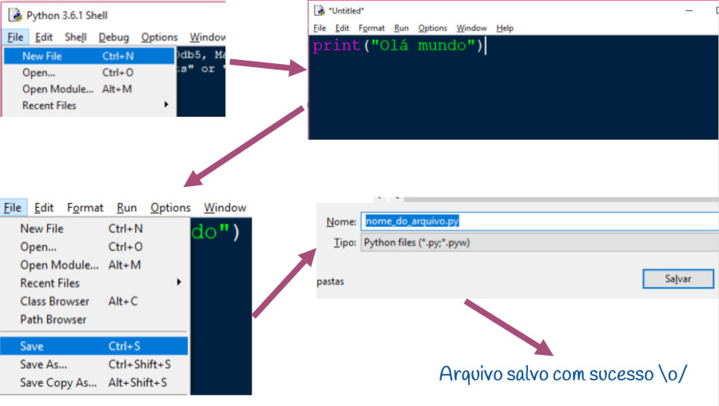

# Instalação do Python

Veja qual é o seu sistema operacional favorito e siga as intruções.
- [Linux](#linux)
- [Windows](#windows)
- [macOS](#macos)

## Linux

### Usando o pyenv
O pyenv permite alternar facilmente entre várias versões do Python. É simples, discreto e segue a tradição UNIX de ferramentas de propósito único que fazem uma coisa bem.

Vamos a sua instalação:

1. Confira o pyenv onde você deseja instalá-lo. Um bom lugar para escolher é o $ HOME / .pyenv (mas você pode instalá-lo em outro lugar).
```
$ git clone https://github.com/pyenv/pyenv.git ~/.pyenv
```
2. Defina a variável de ambiente PYENV_ROOT para apontar para o caminho onde o pyenv repo é clonado e adicione $ PYENV_ROOT / bin ao seu $ PATH para acessar o utilitário de linha de comando pyenv.
```
$ echo 'export PYENV_ROOT="$HOME/.pyenv"' >> ~/.bashrc
$ echo 'export PATH="$PYENV_ROOT/bin:$PATH"' >> ~/.bashrc
```
> Nota Zsh: Modifique seu arquivo ~/.zshenv ao invés de ~ /.bashrc.
3. Adicione o pyenv init ao seu shell para ativar os shims e o autocompletion. Por favor, certifique-se que eval "$ (pyenv init -)" é colocado no final do arquivo de configuração do shell, pois ele manipula o PATH durante a inicialização.
```
$ echo -e 'if command -v pyenv 1>/dev/null 2>&1; then\n  eval "$(pyenv init -)"\nfi' >> ~/.bashrc
```
> Nota Zsh: Modifique seu arquivo ~/.zshenv ao invés de ~ /.bashrc.
4. Reinicie seu shell para que as alterações de caminho entrem em vigor. Agora você pode começar a usar o pyenv.
```
$ exec "$SHELL"
```
5. Instale as versões do Python em $ (pyenv root) / versions. Por exemplo, para baixar e instalar o Python 3.7.0, execute:
```
$ pyenv install 3.7.0
```
6. Colocando a versão 3.7.0 default
```
$ pyenv global 3.7.0
```
7. Checando a versão do python
```
$ python -V
```

## Windows

### Baixando do https://www.python.org/
1. Entre no site da [Python Software Foundation](https://www.python.org/) e faça download da versão 3.7.0.



2. Clique duas vezes no instalador, selecione "add Python 3.7 to PATH" e clique em "Install Now"



3. Agora, espere...



4. Pode rolar isso... Mas é só clicar no Disable path



5. Bora abrir a telinha preta de hacker! Essa tela e chamada de console python ;)



6. Agora vamos abrir o IDLE que é um editor de código simples para python. Procure por "IDLE"




7. Salvando o seu código escrito no IDLE Clique em:
- "File" > "New File" (ou ctrl + n)
- Coloque seu "print" no arquivo que você acabou de abrir
- "File" > "Save" (ou ctrl + s)
- Escolha o nome do arquivo
E... Pronto! Agora tudo o que você escreveu estará salvo!


## macOS

### Usando o pyenv
O pyenv permite alternar facilmente entre várias versões do Python. É simples, discreto e segue a tradição UNIX de ferramentas de propósito único que fazem uma coisa bem. Vamos utilizar o brew para instalar o pyenv.

Vamos a sua instalação:

1. Instalando o pyenv
```
$ brew update
$ brew install pyenv
```
2. Instale a versão do python 3.7.0
```
$ pyenv install 3.7.0
```
3. Colocando a versão 3.7.0 default
```
$ pyenv global 3.7.0
```
4. Checando a versão do python
```
$ python -V
```